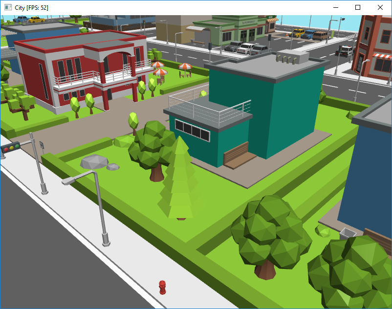
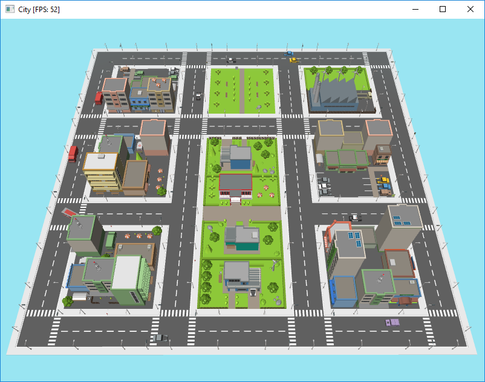
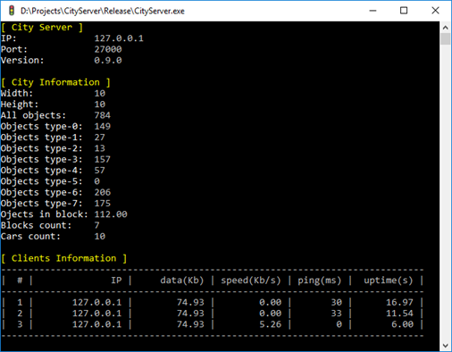

# City Server

## О программе
Простой сервер симулятора города: генерируется случайный город и отвечает на запросы клиентов.

---

## Запуск
Для запуска сервера рекомендуется использовать файл ``run_server.bat``, чтобы увидеть ошибки, в случае их возникновения.

---

## Файлы
Ниже приведены файлы и папки, необходимые для сервера:
- **server_settings.xml** – основные настройки сервера (все параметры приведены в следующем параграфе);
- **generator_data/demo_scene.xml** – описание демонстрационной сцены;
- **generator_data/roofs.xml** – связь шаблонов крыши с зданиями;
- **generator_data/cars.xml** – частоты появления транспорта;
- **generator_data/variants_list.xml** – список вариантов объектов для пресетов;
- **generator_data/bounding_boxes.xml** – размеры ограничивающих параллелепипедов для все объектов;
- **generator_data/roof_presets/\*** – все возможные варианты крыши;
- **generator_data/area_presets/\*** – файлы всех кварталов.

---

## Настройки сервера
Для запуска сервера необходим файл **server_settings.xml**.

Раздел        | Параметр            | Описание                                
--------------|---------------------|-----------------------------------------
Net           | IP                  | IP адрес сетевого интерфейса сервера.
Net           | Port                | Порт, с которым "связывается" сервер. По умолчанию 27000
Net           | Ping                | Искусственная задержка между запросом клиента и ответом сервера. Атрибуты ```min``` и ```max``` задают интервал задержки в миллисекундах. По умолчанию ```min=0```, ```max=0```.
Net           | ShowClients         | Вывод информации о клиентах, если атрибут ```value="1"```. Подробнее о таблице клиентов описано в следующем параграфе.
City          | Seed                | Зерно генератора псевдослучайных чисел. Значение -1 в качестве ```seed``` использует текущее время.
City          | Size                | Размеры города ```width``` и ```height```. Минимальный размер 4x4. Если останется лишняя часть области, то она будет отброшена.
City          | Cars                | Количество транспорта в городе. В атрибуте ```count``` задается целое число. Если указанное количество транспорта нельзя разместить, то будет выбарно максимальное значение для данного размера города.
City          | HydrantProbability  | Вероятность появления пожарного гидранта на каждой улице (дорога от перекрёстка до перекрёстка). Атрибут ```0.0 <= probability <= 1.0```.
City          | HydrantProbability  | Вероятность появления крыши здания. Атрибут ```0.0 <= probability <= 1.0```.

---

## Информация о клиентах
Информация о клиентах отображается в виде таблицы. Описание столбцов приведено ниже:
- **IP** – IP-адрес клиента;
- **data** – общее количество принятых и отправленных данных в Кб;
- **speed** – скользящее среднее скорости передачи и отправки данных за последние 10 секунд;
- **ping** – время прошедшее между приёмом и ответом для последнего запроса в миллисекундах;
- **uptime** – время с момента подключения клиента в секундах.

---

## Скриншоты

Пример сгенерированного из xml файла квартала:


Пример всей сцены размером 8x8:


Интерфейс сервера:

